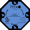

# LCONNECT (river-Lake CONNECTivity) 

## About LCONNECT
LCONNECT is a framework based on machine learning and spectral similarity features to predict when floodplain lakes are connected or not-connected to the main river. The assumption is that the spectral similarity between river and lake waters is a good proxy for the hydrological connectivity and this methodology is applicable when the main river drives the changes on the optical water properties (i.e., flux of high sediment load waters) of its flooding lakes.

 

